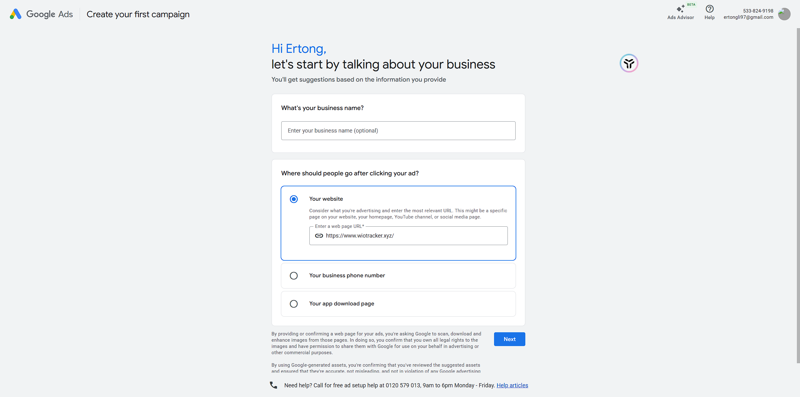

# 国内开发者低成本变现指南 (Google Ads & Payments)

本指南专为中国国内开发者设计，旨在以**最小的成本**和**最合规**的方式，实现海外产品的广告变现（Google AdSense）和支付收款（Lemon Squeezy）。

---

## 第一部分：Google AdSense (广告变现)

Google AdSense 是目前网页端最主流、最稳定的广告变现平台。

### 1. 注册准备 (无需翻墙工具)
*   **Google 账号**: 建议使用干净的 Gmail。
*   **网站**: 必须有一个内容充实、原创的网站（像 WIO 这种工具类网站也很受欢迎，但需要有一定文字说明，比如 SEO_GUIDE 中提到的博客内容）。
*   **手机号**: 中国大陆手机号（+86）完全支持。
*   **地址**: **关键点！** 填写居住地址时，请使用**拼音**填写。



### 2. 关键步骤：身份验证与 PIN 码
这是国内开发者最容易卡住的地方。
*   **身份验证**: 当达到 $10 收入时，需要上传身份证。直接拍摄国内身份证正反面即可。
*   **PIN 码验证**: Google 会通过**平信**（不是快递，是塞邮箱的那种）寄给你一张纸，里面有 PIN 码。
    *   **技巧**: 在地址栏的最后，或者“地址栏2”中，务必填上你的**手机号**（例如：`... District, Beijing, Phone: 138xxxxxxx`）。这样邮递员投递时如果找不到人，可能会给你打电话。

### 3. 收款设置 (最省钱方案)
国内开发者通过 AdSense 收款其实非常简单，**不需要**注册香港银行卡或虚拟卡。
*   **方式**: 选择“电汇到银行账户” (Wire Transfer to bank account)。
*   **银行选择**: 推荐 **招商银行** 或 **中国银行**。
    *   在银行 App 中查询“境外汇入汇款指引”，获取 Swift Code 和英文地址。
*   **成本**: 
    *   Google 端：免费汇出。
    *   中转行/接收行：通常扣除 $10 - $25 不等的手续费。
    *   **结汇**: 钱到了银行 App 后，直接在 App 里操作“结汇”，把美元换成人民币，每年有 5 万美元额度。

### 4. 代码集成
我已为您创建了组件 `src/app/components/GoogleAdsense.js`。

**使用方法**:
在 `src/app/layout.js` 中引入：

```javascript
import GoogleAdsense from './components/GoogleAdsense';

export default function RootLayout({ children }) {
  return (
    <html lang="en">
      <head>
        {/* 其他标签... */}
      </head>
      <body>
        {/* 将下面的 ID 替换为你申请到的 ID */}
        <GoogleAdsense pId="ca-pub-XXXXXXXXXXXXXXXX" />
        {children}
      </body>
    </html>
  );
}
```

---

## 第二部分：支付收款 (Lemon Squeezy)

对于国内个人开发者，直接注册 Stripe 极其困难（需要海外公司或香港银行账户，且容易被封号）。
**强烈推荐使用 Lemon Squeezy**。

### 为什么选 Lemon Squeezy?
1.  **Merchant of Record (MoR)**: 他们作为商家向用户卖货，处理全球复杂的税务（VAT等），然后把利润分给你。这对个人开发者是巨大的解脱。
2.  **支持国内个人**: 注册时国家选 "China"，直接用身份证验证。
3.  **支付方式全**: 你的客户可以用 **支付宝 (Alipay)**、微信支付、PayPal、信用卡付款。
4.  **无固定月费**: 只有交易成功才收费 (5% + $0.50)，适合起步阶段。

### 1. 注册与激活
1.  访问 [Lemon Squeezy 官网](https://www.lemonsqueezy.com/) 注册。
2.  **Store Setup**:
    *   **Country**: China
    *   **Business Type**: Individual (个人)
    *   **Payout Details**: 填写你的个人信息。

### 2. 提现路径 (资金回国)
Lemon Squeezy 支持 PayPal 提现。
*   **路径**: Lemon Squeezy -> PayPal (个人国区账号) -> 连连支付(LianLian) / 派安盈(Payoneer) -> 国内银行卡。
*   **注意**: 
    *   不要尝试直接把 PayPal 里的钱电汇到国内银行，大概率会被退回（因为是公对私汇款）。
    *   必须通过“连连支付”或“派安盈”这种拥有跨境支付牌照的第三方服务商中转。注册连连支付时，选择“跨境电商/服务贸易”，绑定 PayPal 即可。

### 3. 代码集成 (最简模式)
最简单的集成方式是使用 **Checkout Links**。
1.  在 Lemon Squeezy 后台创建一个 Product (例如 "WIO Pro Plan - $9.90")。
2.  获取该商品的 **Checkout Link** (例如 `https://store.lemonsqueezy.com/checkout/buy/xxxx`)。
3.  在代码中直接使用链接：

```javascript
// 示例：在 src/app/settings/page.js 中添加升级按钮
<a 
  href="https://store.lemonsqueezy.com/checkout/buy/xxxxxx" 
  target="_blank" 
  className="bg-blue-600 text-white px-4 py-2 rounded hover:bg-blue-700"
>
  升级到 Pro 版
</a>
```

---

## 附录：Google AdSense 详细配置教程 (如何使用)

当您通过审核并拿到 Publisher ID 后，还需要进行配置才能显示广告。

### 1. 必做：配置 ads.txt
Google 会检测您的网站根目录下是否有 `ads.txt` 文件，用于防止广告欺诈。
我已为您创建了 `public/ads.txt` 文件。

**操作步骤**:
1.  登录 AdSense 后台。
2.  点击 "Sites" (网站)。
3.  AdSense 会提示 "ads.txt not found" (未找到 ads.txt)，并给您一段代码。
4.  代码格式类似于：`google.com, pub-xxxxxxxxxxxxxxxx, DIRECT, f08c47fec0942fa0`。
5.  打开项目中的 `public/ads.txt` 文件，将内容**完全替换**为您从 AdSense 获取的那一行。
6.  重新部署项目 (Push to GitHub)。

### 2. 方式一：自动广告 (Auto Ads) - 最简单
这是最推荐新手的模式。Google 会自动分析您的页面结构，在合适的位置插入广告。

**操作步骤**:
1.  在 AdSense 后台，点击 "Ads" (广告) -> "By site" (按网站)。
2.  找到您的网站，点击右侧的 "Edit" (编辑笔图标)。
3.  在右侧面板，打开 "Auto ads" (自动广告) 开关。
4.  (可选) 点击 "Ad formats" 选择您喜欢的广告类型（如：页内广告、锚定广告等）。
5.  点击 "Apply to site" (应用到网站)。
6.  **代码端**: 确保您已按照本文第一部分，在 `src/app/layout.js` 中启用了 `<GoogleAdsense />` 组件。

### 3. 方式二：手动广告单元 (Manual Ad Units) - 更可控
如果您希望精确控制广告位置（例如：只在侧边栏显示），可以使用手动单元。

**操作步骤**:
1.  在 AdSense 后台，点击 "Ads" (广告) -> "By ad unit" (按广告单元)。
2.  选择 "Display ads" (展示广告)。
3.  给广告单元起个名（例如 "Homepage Sidebar"），选择 "Responsive" (自适应)。
4.  点击 "Create" (创建)。
5.  您会获得一段代码，其中有两个关键 ID：`data-ad-client` (即 Publisher ID) 和 `data-ad-slot` (广告位 ID)。

**代码集成**:
我已为您创建了 `src/app/components/GoogleAdUnit.js` 组件。

在您想放置广告的页面（例如 `src/app/page.js`）中：

```javascript
import GoogleAdUnit from './components/GoogleAdUnit';

// ... 在 JSX 中 ...
<div className="my-ad-container">
  <GoogleAdUnit 
    pId="ca-pub-XXXXXXXXXXXXXXXX" 
    slotId="1234567890"  // 填入您刚刚生成的 Slot ID
  />
</div>
```

---

## 附录：Google Ads (广告投放/买量) 简介

如果您想通过**付费**方式获取流量（User Acquisition），可以使用 Google Ads (AdWords)。
*注意：这是花钱的，不是赚钱的。*

### 1. 免费利用：关键词规划师 (Keyword Planner)
即使不花钱买广告，您也应该注册一个 Google Ads 账号，为了使用它的 **Keyword Planner** 工具。
*   **作用**: 查看用户都在搜什么词（例如 "WIO calculator", "office tracker"），以及这些词的搜索量。
*   **用法**: 用这些词优化您的 SEO（写入 `src/app/layout.js` 的 `keywords` 字段）。

### 2. 低成本投放策略
如果您想尝试投放：
*   **寻找优惠码**: Google 常给新用户发 "$500 credit" (充多少送多少) 的优惠券，留意邮件。
*   **搜索广告 (Search Ads)**: 仅投放 "Intent" 强烈的词（例如 "work attendance tracker app"），不要投大词（如 "calculator"）。
*   **设置预算上限**: 务必设置 Daily Budget (日预算)，例如 $5/天，防止扣费失控。

---

## 总结：最小成本方案清单

1.  **服务器**: Vercel (免费版起步) + Supabase (免费版起步)。
2.  **域名**: NameSilo / Cloudflare ($10/年)。
3.  **广告**: Google AdSense (免费申请，电汇收款)。
4.  **支付**: Lemon Squeezy (免费注册，按成交付费，PayPal 收款)。
5.  **结汇**: 连连支付 / 派安盈 (费率约 0.5% - 1.2%)。

**总启动资金**: 仅需域名费，甚至可以用 Vercel 免费子域名实现 **0 成本** 启动。
